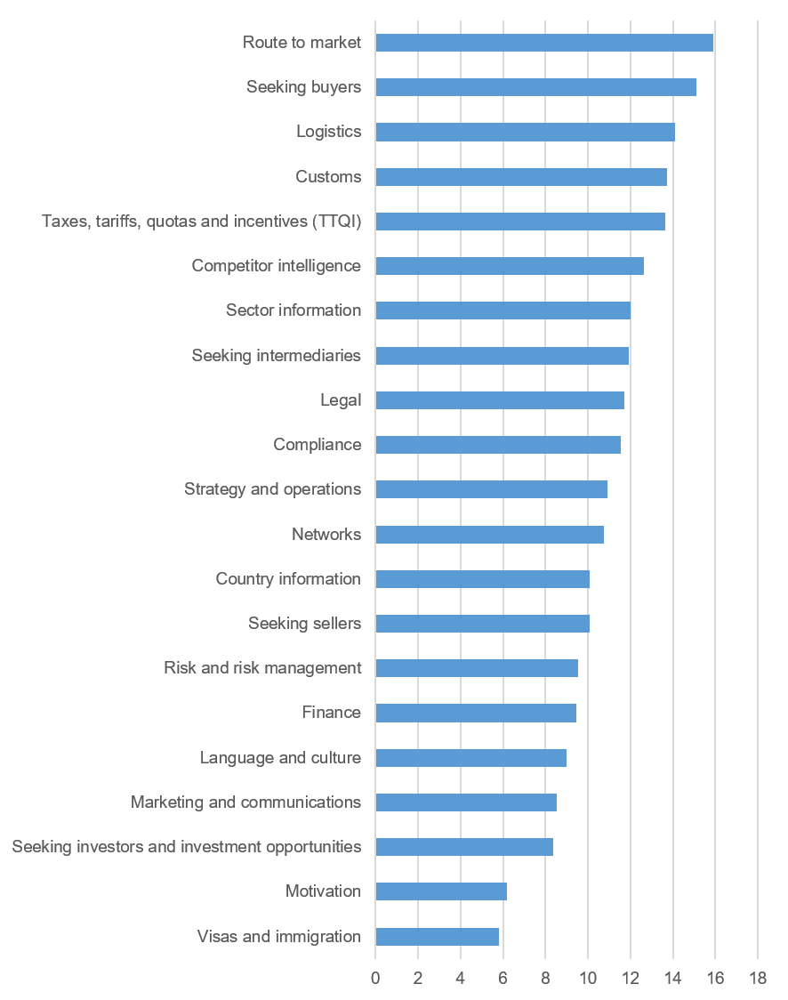
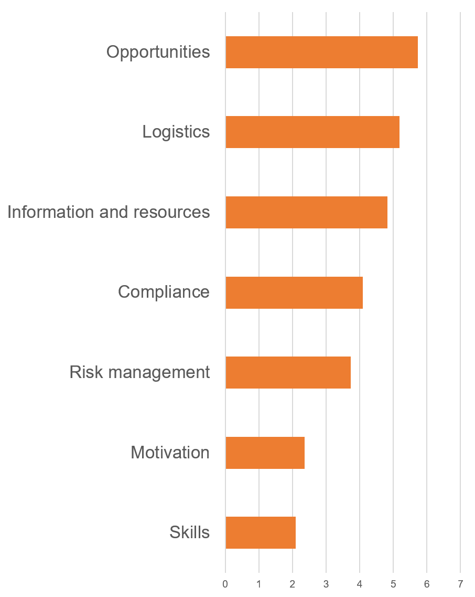

**Phase**
    Discovery

**Audience**
- Customers
   - 4 x NON EXPORTERS
   - 4 X Early stage Exporters
   - 4 x SME Exisiting Exporters

**We were focusing on**
- Prioritising Support Needs
- Investigating differing needs for each company stage

**What we discovered**
- Common Themes
   - UNCERTAINTY
   - NOISE
   - Not sure who to talk to
   - Time Poor
   - The information is not sector specific enough
- 5 main types of customer / need
   - A. I started exporting due to an international request and had to learn very quickly
   - B. I am looking for tarrifs and customs info
   - C. I am looking for opportunities
   - D. I am looking for intermediary info (distributors etc...). "I got stung in the past"
   - Z. Doing fine alone
   
   
**Prioritised User Needs**   
<!--more-->

